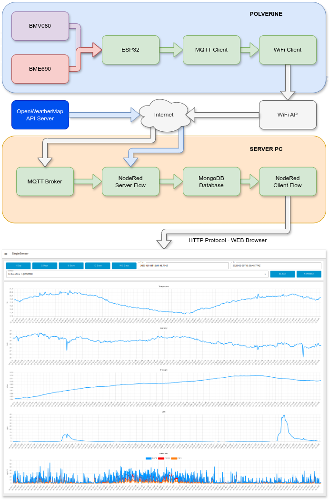

## POLVERINE_FULL_MQTT_DEMO: A Complete Solution for Sensor Data Collection and Analysis

### A Comprehensive System Architecture

At the heart of this solution lies POLVERINE_FULL_MQTT_DEMO firmware. This firmware collects sensor measurements and transmits them using the ESP32-S3 module's WiFi capabilities to an MQTT broker. From there, a NodeRed ["Server Flows"](../nodered/server_flows.json) monitors the broker's message queue and systematically archives all incoming data in a MongoDB database.

The system also benefits from the latest SDK for the BMV080 sensor, which is now publicly available. This SDK enables the reading of particulate matter (PM) values for PM10, PM2.5, and PM1. The full range of sensed quantities includes:

- Temperature
- Relative Humidity
- Barometric Pressure
- Volatile Organic Compounds (V.O.C.)
- Particulate Matter 10 (PM10)
- Particulate Matter 2.5 (PM2.5)
- Particulate Matter 1 (PM1)

In addition to local sensor data, the server-side processing layer integrates with OpenWeatherMap's API to enrich the dataset with external environmental parameters such as temperature, humidity, barometric pressure, wind speed, and cloud cover percentages.

### Data Visualization Made Easy

To facilitate data analysis and visualization, a separate NodeRed ["Client Flows"]((../nodered/client_flows.json)) interface has been developed. This interface allows users to dynamically query the MongoDB repository and visualize data directly in a web browser. Users can select metrics from individual devices or compare data from multiple units, with flexible time filters enabling detailed examination of trends over configurable periods.

### Adding Bosch SDKs to Polverine source code

The POLVERINE_FULL_MQTT_DEMO communicates with the Bosch BME690 & BMV080 sensors and need to use the SDKs published by Bosch Sensortec.

The SDKs source code and compiled libraries cannot be stored in this repository, but must be downloaded by the user from the Bosch website by accepting the licence agreement.

- [BMV080 SDK r.11.0.0](https://www.bosch-sensortec.com/software-tools/double-opt-in-forms/sdk-v11-0-0.html)
- [BME690 BSEC r.3.1.0](https://www.bosch-sensortec.com/software-tools/double-opt-in-forms/bsec-software-3-1-0-0-form-1.html)

#### Bosch BMV080 SDK
1) Unzip the downloaded BMV080 SDK file 
2) move the SDK's folder into the ../deps/bosch-sensortec/ folder
3) and rename it as: "BMV080-SDK"

The folder "BMV080-SDK" should have the following subfolders and/or files:

- CHANGELOG.md  
- LICENSE.md  
- README.md  
- api  
- api_examples"

#### Bosch BME690 BSEC Library
1) Unzip the downloaded BSEC Library file 
2) move the library's folder into the ../deps/bosch-sensortec/ folder
3) and rename it as: "bsec_library_v3.x"
 
The folder "bsec_library_v3.x" should have at least the following subfolders and/or files:

- algo
- examples

### Firmware Customization

To make the application work correctly in your environment you must customize some settings:

#### WiFi connection configuration

- in the file /src/connectivity/wifi_connect.c must replace the dummy xxxxxxxxx in DEFAUT_POLVERINE_WIFI with actual values, for example:

		const char *DEFAULT_POLVERINE_WIFI = "{\"ssid\":\"AccessPointID\",\"pwd\":\"AccessPointPassword\"}";

#### MQTT connection configuration

- in the file /src/mqtt_main.c must replace the dummy xxxxxxxxx in TEMPLATE_POLVERINE_MQTT with actual values, for example:

		const char *TEMPLATE_POLVERINE_MQTT = "{\"uri\":\"mqtt://mqttserver.local\",\"user\":\"username\",\"pwd\":\"userpassword\",\"clientid\":\"%s\"}";

	- uri : MQTT broker address
	- user : username to have access to MQTT broker
	- pwd : password assigned to the user
	- clientid : you can use the %s placeholder to have a unique ID or specify your own .

- you can customize MQTT topics changing the values in TEMPLATE_POLVERINE_TOPIC .

		const char *TEMPLATE_POLVERINE_TOPIC = "{\"bmv080\":\"polverine/%s/bmv080\",\"bme690\":\"polverine/%s/bme690\",\"cmd\":\"polverine/%s/cmd\"}";

	- bmv080 : MQTT topic to publish BMV080 sensor data
	- bme690 : MQTT topic to publish BME690 sensor data
	- sys: MQTT topic to publish Polverine system data
	- cmd : MQTT topic to subscribe to commands sent to the device

the %s placeholder is dynamically substituted with the unique ID of the device, i.e. with the 6 terminating characters of the MAC address of the device.

### Firmware Upload
The POLVERINE_FULL_MQTT_DEMO puts the ESP32-S3 MCU in low power mode that disables USB. To upload the firmware using USB port you must put Polverine in boot mode: 

1. press boot button (SW1 - BOOT)
2. press reset button (SW2 - EN)
3. release reset button
4. release boot button
5. upload firmware
6. press reset button
7. release reset button

When in bootloader mode the RGB led is lit.
