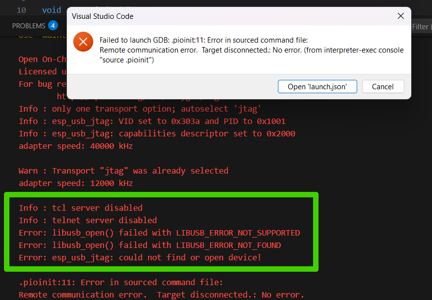
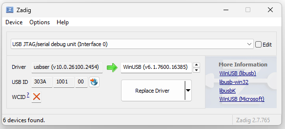
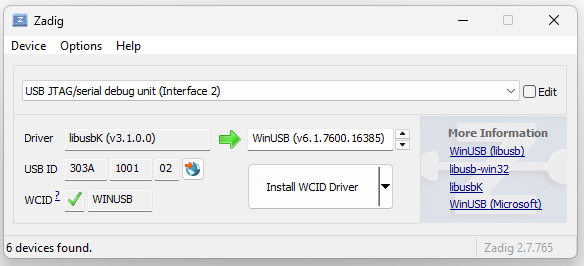
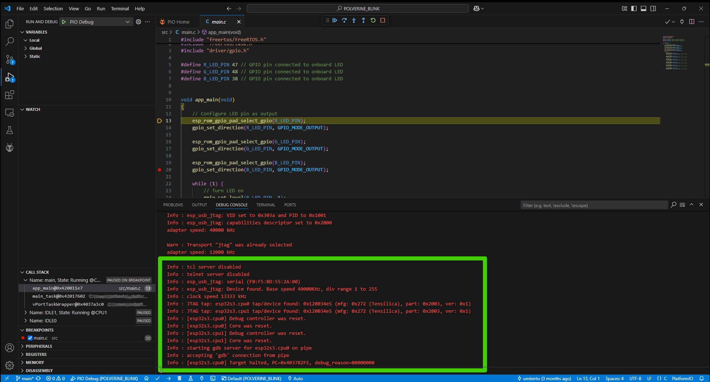

# Polverine
The Polverine project is a mikroBUS™ board designed for environmental sensing and monitoring applications.

The demo application from this repository can be compiled using PlatformIO IDE inside Visual Studio Code IDE.

We support programming the Polverine board on Linux and Windows 11 OSs.

A PC with Linux or Windows, and an USB-C cable is all you need to program the Polverine board.

For more information and Polverine FAQ go to our [website](https://www.blackiot.swiss/polverine_faq).

## 3D Printed Cover
Various versions of 3D printable shields are availble from the community:

- [Makerworld mode from skunkyprototypes](https://makerworld.com/en/models/1806923-blackiot-polverine-cover#profileId-1988748).
    

## Visual Studio Code with PlatformIO
Visual Studio Code can be freely downloaded and from the [CODE site](https://code.visualstudio.com/)
Once installed on your PC, select and install PlatformIO from the "Extensions Marketplace".

### GIT support

To use the code in the polverine repository click on the "Source Control" icon in VSCode interface and follow instructions to download and install the latest GIT version.

Then enter  `https://github.com/BlackIoT/Polverine.git` to connect to BlackIoT Polverine GitHub repository and download code samples and instructions. 

### Custom Embedded Board
Reference:
[Custom embedded board](https://docs.platformio.org/en/stable/platforms/creating_board.html)

The custom embedded board JSON file for polverine board to be used in PlatoformIO environmentis in folder /boards .

1) Create `boards` directory in core_dir if it doesn’t exist.
    - in Windows: `%HOMEPATH%\.platformio`
    - in Linux: `~/.platformio`
2) Copy `polverine.json` file in this boards directory.
3) Search available boards via `pio boards` command. You should see `polverine` board.

Now, you can use `polverine` for the board option in “platformio.ini” (Project Configuration File).

### Debug the Polverine

The ESP-S3 MCU supports native JTAG debugging using the USB port on Polverine.

The installation on Windows 11 requires an USB drivers custom configuration to work properly.

The USB port on the Polverine board opens 2 interfaces, one for "serial like" communication (called interface 0) and another one for JTAG debugging (called interface 2).

When starting the PIO debugger interface in VSCode you may see the error:

The green rectangle outlines the reason of the failure: error to open the USB port.

To correct this error you must use the [ZADIG](https://zadig.akeo.ie/) to configure the USB drivers.

Download and run the ZADIG application, select Options -> List all Devices menu option and select the drivers:

Interface 0 must use usbser driver, interface 2 must use libusbK driver.

Press on the "Replace Driver" button to select the correct driver.

No need to reboot the PC, just restart PIO debugging

The green rectangle contains the correct GDB startup messages.

## Source Code Demos & Bosch SDKs

The demos in this repository that communicate with the Bosch BME690 & BMV080 sensors need to use the SDKs published by Bosch Sensortec.

The SDKs source code and compiled libraries cannot be stored in this repository, but must be downloaded by the user from the Bosch website by accepting the licence agreement.

- [BMV080 SDK r.11.2.0](https://www.bosch-sensortec.com/software-tools/double-opt-in-forms/sdk-v11-2.html)
- [BME690 BSEC r.3.2.1](https://www.bosch-sensortec.com/software-tools/double-opt-in-forms/bsec-software-3-2-1-0-form.html)

Each project that uses the Bosch SDKs will contain a README file with instruction for copying needed files from Bosch file tree into the project source tree.

## The Demos

Brief description of the Demo Projects contained in this repository.

- **POLVERINE_BLINK** this is the "hello world" for the embedded firmware: just blinks the RGB led. For more information [README](/POLVERINE_BLINK/README.md)
- **POLVERINE_DEMO** basic example of reading data from the sensor and streraming to the USB port. This is the default demo firmware pre-installed on Polverine.
For more information [README](/POLVERINE_DEMO/README.md)
- **POLVERINE_FULL_MQTT_DEMO** full application implementing publishing sensor data to MQTT broker. For more information [README](/POLVERINE_FULL_MQTT_DEMO/README.md)
- **POLVERINE_FULL_BLE_DEMO** full application implementing publishing sensor data with BLE serial emulation. For more information [README](/POLVERINE_FULL_BLE_DEMO/README.md)
- **POLVERINE_HOMEASSISTANT_DEMO** full application implementing publishing sensor data to MQTT broker compatible with Home Assistant. For more information [README](/POLVERINE_HOMEASSISTANT_DEMO/README.md) and [README_SETUP](/POLVERINE_HOMEASSISTANT_DEMO/README_SETUP.md) for Home Assistant configuration

## First time initialization

The PlatformIO IDE automagically loads the bootloader binary and the partition table to the ESP32-S3 MCU the first time it is programmed. 

If you want to initialize and load the blink demo from the esptool commandline tools, follow the instructions in [README](./first_time_init/README.md) file.

## Uploading the firmware

The Polverine board supports loading the firmware from the USB connection.

If the USB port is not responding (for example the MCU is in low power state) the device can be rebooted into bootloader firmware with the sequence:

1. press boot button (SW1- Boot)
2. press reset button (SW2 - EN)
3. release reset button 
4. release boot button 
5. upload the firmware
6. press reset button 
7. release reset button 

When in bootloader mode the RGB led is lit.

# NodeRed Flows
Two NodeRed flows are saved in the nodered folder.

Refer to the [README](./nodered/README.md) file in nodered folder for flows description.

# MongoDB Database

Refer to the [README](./mongodb/README.md) file in mongodb folder for database description.

# Arduino IDE support

Polverine board is fully compatible with the Arduino IDE. To use it, install the ESP32 support package by Espressif Systems, and select "ESP32S3 Dev Module" as the board in the IDE.

Debugging features are fully supported.

To begin programming, use the **ARDUINO_BLINK** example. For sensor integration, download the SDKs for the BME690 and BMV080 sensors from the Bosch Sensortec website.
